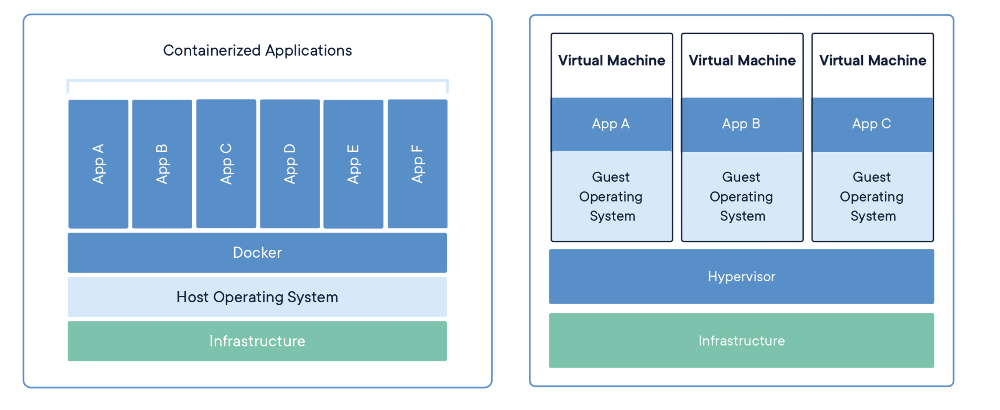
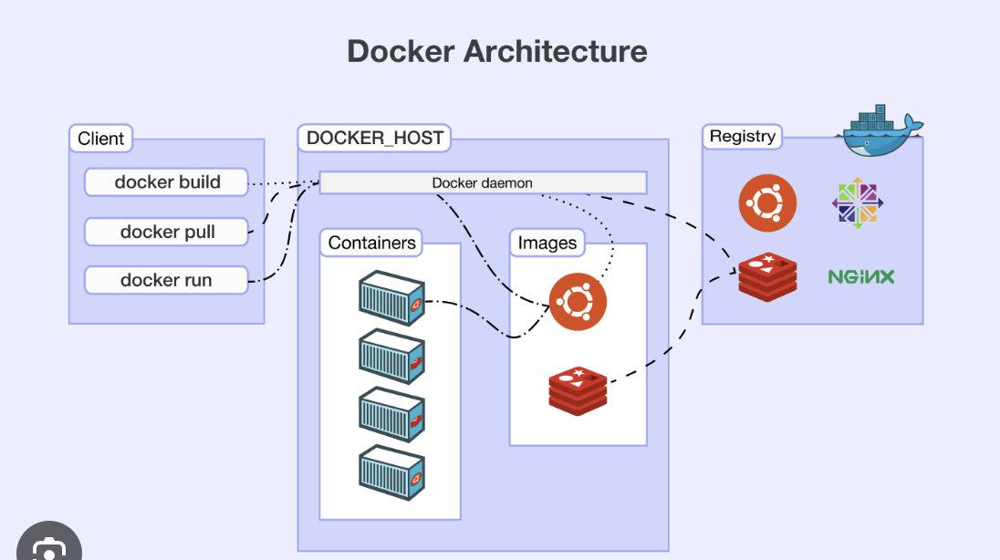
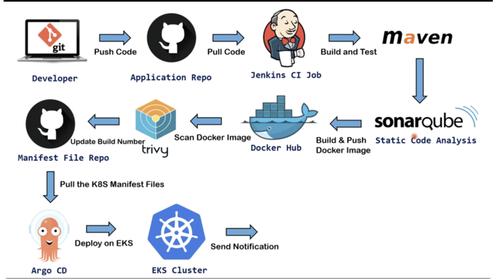

# Course content 
- Docker Basics
- Docker architecture
- Docker commends
- How to write the docker file 
- How to build the image and push to docker registory ss
- Docker volume








# Kubernetes
- what / why  to use kubernetes
- Architecture
- Setup lab env ( Minikube / On top of VM / Manage k8s (EKS, AKS) ) 
- Kubernetes pod
- Deployment  and replica set
- stateful set and deamon set 
- persistent volume and volume mount 
- Resource management 
- Probes 
- Secrets and config
- RBAC ( Service account)
- Network policy 
- HPA and PDB
- Helm chart
- Observability ( logging, monitoring and alerting )
- Real world deployment - End to end application deployment 
- Troubleshooting





# 00 Docker recap
- Switch to sample-app directory  
`cd app`

- Build docker image  
`docker build -t nginx .`
    <details>
        <summary>output</summary>

    ```sh
    > docker build -t sample-app:1.0 .
    [+] Building 2.8s (10/10) FINISHED
    => [internal] load build definition from Dockerfile                                                                                                         0.1s
    => => transferring dockerfile: 543B                                                                                                                         0.0s
    => [internal] load .dockerignore                                                                                                                            0.0s
    => => transferring context: 2B                                                                                                                              0.0s
    => [internal] load metadata for docker.io/library/python:3.9                                                                                                2.6s
    => [auth] library/python:pull token for registry-1.docker.io                                                                                                0.0s
    => [1/4] FROM docker.io/library/python:3.9@sha256:2d8875d28ca023a9056a828518adcdd634ba03740e1e3b197c06eb4527c6152c                                          0.0s
    => [internal] load build context                                                                                                                            0.0s
    => => transferring context: 2.79kB                                                                                                                          0.0s
    => CACHED [2/4] WORKDIR /app                                                                                                                                0.0s
    => CACHED [3/4] COPY . /app                                                                                                                                 0.0s
    => CACHED [4/4] RUN pip install -r requirements.txt                                                                                                         0.0s
    => exporting to image                                                                                                                                       0.0s
    => => exporting layers                                                                                                                                      0.0s
    => => writing image sha256:1f62567a00e68173ee2693c9d9da6522e5fdbbfbc2a1abbac20462425be123df                                                                 0.0s
    => => naming to docker.io/library/sample-app:1.0                                                                                                            0.0s

    Use 'docker scan' to run Snyk tests against images to find vulnerabilities and learn how to fix them
    ```

    </details>

- Push image to dockerhub  
`docker push nginx`

- Run docker container  
`docker run -p 8001:8001 relambda/sample-app:v1.0` 


# 01 K8s rapid mode
> Demo


1. Create a pod that using **echo-server** image  
`kubectl create deployment --replicas=3 echo-server --image=ealen/echo-server`

2. Expose the pod so that we can access the service in our browser  
`kubectl expose deployment echo-server --type=LoadBalancer --port=80 --target-port=80`

3. Create minikube tunnel (not required in case of eks or other managed services)
`minikube tunnel`

4. Access the service using curl  
`curl localhost`

5. Loadbalancing  
`watch -d curl --silent 'localhost/?echo_env_body=HOSTNAME'`

6. Scale deployment  
`kubectl scale deployment/echo-server --replicas=10`

7. Update image  
`kubectl set image deployment/echo-server image=nginx`

8. Cleanup
```
kubectl delete deployment echo-server
kubectl delete service echo-server
```
- Discussion
    - Imperative vs Declarative
        Imperative is when you give granular commands, usually in a sequence, to get something done. 
            eg: create secret -> create deployment -> expose a service 
        Declarative is when you describe the desired state (using yml files) and submit them to the orchestrator.
    - Idempotency 
        A property in computer science that describes an operation's ability to produce the same result, regardless of how many times it is executed.
    - Ephemeral
        The resources created are lost in case your cluster crashes. It is always a good idea to store these resources as code (eg: yml files) in a git repository.

# 02 Kubernetes pods
0. Change your working directory  
    ```sh
    cd ~/k8s-101/manifests/pod
    ```
1. Create pods using manifest files. You can give more than one yaml file at a time.
    ```sh
    kubectl apply -f redis-pod.yml,nginx-pod.yml
    .. pod/nginx created
    .. pod/apache created
    ```

2. Verify that the pods got successfully deployed
    ```sh
    kubectl get pods
    .. NAME    READY   STATUS    RESTARTS   AGE
    .. nginx   1/1     Running   0          14m
    .. redis   1/1     Running   0          11m
    ```

3. Show labels of the running pods
    ```sh
    .. NAME    READY   STATUS    RESTARTS   AGE   LABELS
    .. nginx   1/1     Running   0          14m   app=nginx
    .. redis   1/1     Running   0          12m   app=redis
    ```

4. Check logs for all pods that have a label `app=redis` assigned to them
    ```sh
    kubectl delete pod -l app=redis
    ```

5. Kill all pods that have a label `app=redis` assigned to them
    ```sh
    kubectl delete pod -l app=redis
    ```

# 03 Kubernetes ReplicaSet
> Demo: ownership of pod objects (diff)
0. Change working directory
    ```sh
    cd ~/k8s-101/manifests/replicasets
    ```

1. Create a ReplicaSet using `rs-nginx.yml` manifest file. Use **nginx** image and create 3 pods.
    - how many new pods will be created when we run apply?
    ```sh
    kubectl apply -f rs-nginx.yml
    .. replicaset.apps/nginx deployed
    ```

2. Deploy a new pod with the same label that is used by **rs-nginx** ReplicaSet created in step 1
    - how many new pods will be created?
    ```sh
    kubectl apply -f pod1.yml
    ```

3. Cleanup
    ```sh
    kubectl delete replicaset rs-nginx
    ```

# 04 Kubernetes Deployment
0. Change working directory
    ```sh
    cd ~/k8s-101/manifests/deployment 
    ```

1. Create a Deployment using `dep-nginx.yml` manifest file.
    ```sh
    kubectl apply -f dep-nginx.yml
    .. deployment.apps/dep-nginx deployed
    ```

2. Set nginx image version to **1.23.4** (old_version: 1.14.2)
    ```sh
    kubectl set image deployment.v1.apps/dep-nginx nginx=nginx:1.23.4 --record
    ```

3. Check deployment rollout history
    ```sh
    kubectl rollout history deployment.v1.apps/dep-nginx
    ```

4. Undo last deployment
    ```sh
    kubectl rollout undo deployment.v1.apps/dep-nginx
    ```

5. Scale up the deployment from 3 pods to 10 pods
    - edit deployment in-place
    ```sh
    kubectl edit deployment dep-nginx
    ```

6. Test a failure scenario by setting the wrong image
    - What will happen here?
    ```sh
    kubectl set image deployment.v1.apps/dep-nginx nginx=nginx:12345
    ```

7. Discuss `RollingUpdate` and `Recreate` deployment strategies.

# 05 Kubernetes Service
0. Change working directory
    ```sh
    cd ~/k8s-101/manifests/service 
    ```

1. Deploy all manifests in the folder
    ```sh
    kubectl apply -f .
    .. deployment.apps/dep-nginx created
    .. deployment.apps/dep-echo-server created
    .. service/svc-nginx created
    .. service/svc-echo-server created
    ```

2. Create a tmp pod to access the service from inside the cluster
    ```sh
    kubectl run tmp-pod --image=nginx:alpine --rm -it -- sh
    .. If you don't see a command prompt, try pressing enter.
    .. # curl svc-nginx
    .. # curl svc-echo-server
    ```

3. LoadBalancer demo
