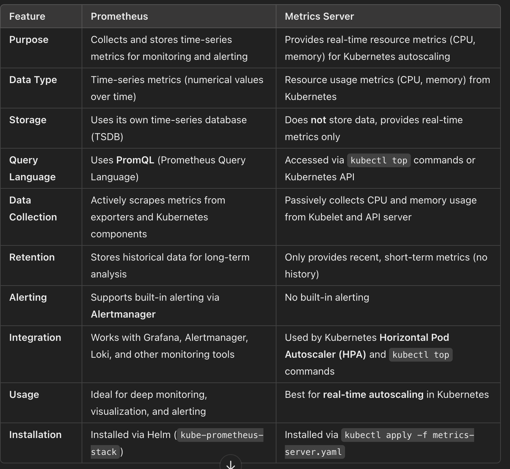

# Prometheus 

Prometheus is a time-series database that collects and stores metrics from applications, services, and infrastructure. It is commonly used in cloud-native environments like Kubernetes.


## How it will work 
- Scrapes metrics from exporters (e.g., Node Exporter, cAdvisor, application endpoints).
- Stores data in its time-series database (TSDB).
- Uses PromQL to analyze and filter metrics.
- Sends alerts via Alertmanager based on defined rules.
- Integrates with Grafana for dashboards and visualization.


Difference between prometheus and metrics server 




## Installation 

````
helm repo add prometheus-community https://prometheus-community.github.io/helm-charts
helm repo update


helm install prometheus prometheus-community/prometheus -n prometheus --create-namespace \
  --set server.service.type=NodePort


kubectl port-forward svc/prometheus-server 9090:80

helm uninstall prometheus -n prometheus

````