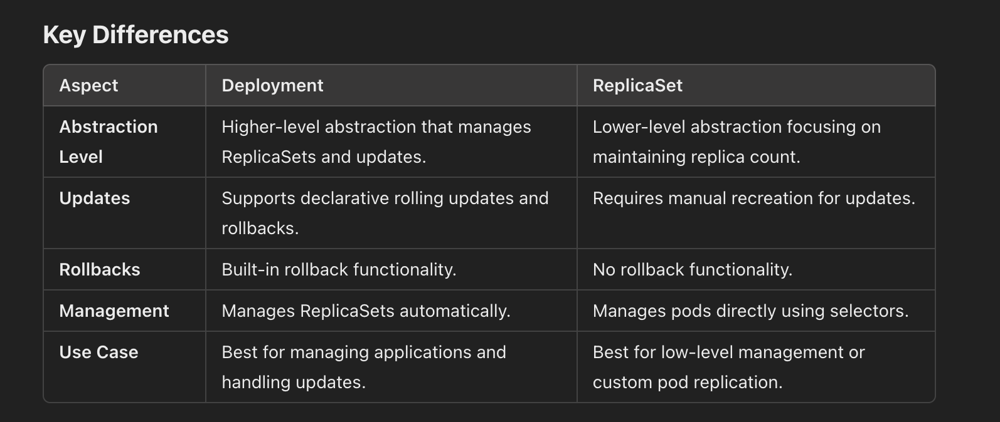

# Deployment 

A Kubernetes Deployment is a higher-level abstraction for managing applications in Kubernetes. It provides declarative updates to applications and ensures that the desired state of the application is maintained over time.


## Key Features of Kubernetes Deployment
- Declarative Updates: You describe the desired state of your application (e.g., number of replicas, container image) in a YAML or JSON file.
- Self-Healing: If a pod crashes or becomes unresponsive, Kubernetes automatically replaces it.
- Scaling: Deployments make it easy to scale applications up or down by changing the replica count.
- Rolling Updates and Rollbacks:
- Perform seamless updates to the application with no downtime.
- Automatically roll back to a previous state if something goes wrong.
- Multi-Version Deployment: Support for blue/green or canary deployments.





# Deployment history 

````
kubectl rollout history deployments/pythonapp -n pythonapp 
kubectl rollout history deployments/pythonapp -n pythonapp --revision=2
kubectl rollout undo deployments/pythonapp -n pythonapp --to-revision=1
````


# Deployment 

````


````